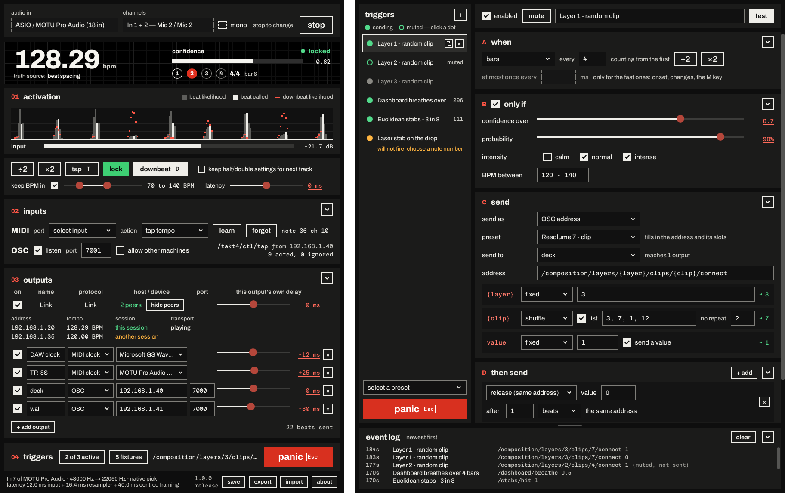

# takt4



takt4 listens to your mixer, finds the beat, downbeat and tempo, and sends them to the rest of
the rig: **Ableton Link, MIDI clock, OSC, MIDI notes and Art-Net lights**. Rules fire clips,
cues, notes and light looks on the music. No click track, no tapping along.

## Get it

- Download `takt4.exe` from the **[latest release](https://github.com/Fohdeesha/takt4/releases/latest)**. One file; put it in any folder it can write to.
- Windows 10 or 11, plus the latest [Visual C++ Redistributable (x64)](https://aka.ms/vc14/vc_redist.x64.exe). Install it even if you have one: an old one lets takt4 start and then fail.
- Not code-signed: if Windows "protected your PC", click **More info**, then **Run anyway**.

## Quick start

1. Pick your interface under **audio in** and the inputs under **channels** (a stereo pair; tick **mono** for one input). Click **start**.
2. Give it a few bars. It says **locked** when it's sure, and nothing goes out to the rig until then. The beat carries on through a breakdown; four seconds of silence stops it, and it says **no signal**.
3. Under **outputs**, tick **Link**, or click **+ add output** and pick its **protocol**: OSC, MIDI, MIDI clock or Art-Net.
4. In the **triggers** row, click **add a rule** (it says **edit rules** once you have some). Pick a ready-made set from **select a preset**, or build your own.

## When the beat is wrong

- A beat or two out: press **downbeat** (or **D**) on the one.
- Half or double speed: **÷2** or **×2**. They reset on the next track unless **keep half/double settings for next track** is ticked.
- Keep it in a range: tick **keep BPM in** and drag its two handles.
- **tap** (or **T**) to tap it in.
- **lock** holds the tempo through a breakdown.
- **latency** moves everything earlier or later.

## Rules

The rule editor (the **triggers** window). **+** adds a rule. Each rule has four sections:

- **A when**: every N beats or bars, the downbeat, a euclidean pattern (3 in 8...), an onset, a tempo change, lock or unlock, an intensity change, or the **M** key. **÷2** / **×2** fire it twice / half as often.
- **B only if** (off until ticked): confidence, probability, intensity, BPM range.
- **C send**: an OSC address, a MIDI note, note off, CC, program change or pitch bend, or a light effect. **send to** picks the outputs; a light effect picks fixtures under **lights** instead.
- **D then send**: follow-ups (a clip release, a note off) after so many ms, beats or bars.

Each `{slot}` in an OSC address gets a value: shuffle (no repeats until all have played), random, cycle, weighted, fixed, a live value (BPM, bar, confidence...) or a ramp. The **preset** box fills in Resolume, TouchDesigner and MadMapper addresses.

- Click a rule's dot to mute it; it keeps time, so it comes back in phase.
- **test** fires it once.
- The **event log** along the bottom shows everything that went out.
- **panic** (or **Esc**, in the main window or the rule editor) stops every rule until **release**.

## Delays

- One **latency** slider for the rig, plus a delay per output. They add up.
- Positive is later, negative is earlier. Once locked, a −300 ms output really gets its cue 300 ms early.
- Click any underlined number to type a value.

## OSC

takt4 sends this feed to the OSC outputs you tick under **/takt4 global messages to**, at the right of the **outputs** heading. None get it until you do; the rules aimed at an output go either way.

```
/takt4/bpm         float   the tempo
/takt4/beat        int     1, on every beat
/takt4/beat/bar    int     which beat of the bar, 1..N
/takt4/downbeat    int     1, on downbeats
/takt4/confidence  float   0 to 1
/takt4/locked      int     0 or 1
/takt4/meter       int     beats per bar
/takt4/resync      int     1, when the tracker has just found itself again
```

To control takt4, tick **listen** on the OSC row under **inputs** (port 7001; this machine only unless **allow other machines** is ticked):

```
address                       send           does
/takt4/ctl/tap                nothing or 1   tap the tempo
/takt4/ctl/downbeat           nothing or 1   the one is now
/takt4/ctl/tempo/halve        nothing or 1   ÷2
/takt4/ctl/tempo/double       nothing or 1   ×2
/takt4/ctl/lock               1 or 0         pin the lock (1), or let it go (0)
/takt4/ctl/panic              anything       panic
/takt4/ctl/panic/release      nothing or 1   release
/takt4/ctl/manual             nothing or 1   fire the manual rules
/takt4/ctl/rule/<id>/enable   1 or 0         switch a rule on (1) or off (0)
/takt4/ctl/rule/<id>/mute     1 or 0         mute (1) or unmute (0) a rule
/takt4/ctl/rule/<id>/double   nothing or 1   fire half as often
/takt4/ctl/rule/<id>/halve    nothing or 1   fire twice as often
/takt4/ctl/rule/<id>/rate     a number       multiply its count, 0.0625 to 64 (2 = half as often), for a fader
/takt4/ctl/rule/<id>/reset    nothing or 1   back to the count it was written with
```

- Send the value as the first argument: an OSC **int** (`i`), **float** (`f`) or **boolean** (`T` is 1, `F` is 0). A string counts as nothing; any other type and the message is ignored.
- **nothing or 1**: a button. Any number but 0 presses it too; a 0 is its release and does nothing, so a push button that sends 1 then 0 presses once. **panic** engages on anything, 0 included.
- **1 or 0**: a switch, never a toggle, so a missed message can't leave one backwards. Anything but 0 is on; with no value it's ignored.
- `<id>` is the rule's id, shown beside its name in the rule editor, or `all`.

**MIDI control**: on the MIDI row under **inputs**, pick the controller's **port** and an **action**, click **learn**, hit the pad. Actions: tap, downbeat, halve, double, lock, panic, release, fire the manual rules. A pad bound to lock pins it only while held.

## Lights

1. **+ add output**, set its **protocol** to Art-Net and type the node's IP (port 6454).
2. Click **patch lights** in the triggers row, then **+** to add a fixture: name, group (optional), universe, **start address** (the one on the fixture), and the nearest **mode** (dimmer, RGB, RGBW, dimmer + RGB, LED par, 8- or 16-bit moving head).
3. **identify** flashes the fixture; a channel's **test** holds it at the **test sends** level for 3 s.
4. In a rule, set **send as** to DMX / Art-Net and pick an effect: level / fade, color, flash, pulse, strobe, hue sweep, position, path, home, blackout.

- Click a fixture's dot to leave it out of the show; copy and × are on its row.
- Every effect ends with its duration, so nothing is left strobing.
- Colors come from a palette (the picker lights the real lamps as you drag) or from red, green and blue values.
- A moving head's **how far it moves** keeps random positions and paths inside the range you set.
- **panic** freezes the lights where they are; **stop** and quitting black them out.

## Saving

- Everything saves by itself to `settings.json` next to `takt4.exe`.
- **export** / **import** carry everything: rules, outputs, lights, tempo settings, the audio input, MIDI and OSC control with what was learned, and which sections are folded. Import replaces it all. An input that isn't on this machine stays the one saved; **rescan** or the next launch finds it once it's plugged in.
- A rule's mute and its ÷2 / ×2 aren't saved.
- takt4 counts in 4/4. For a set with waltzes, close it and change `"meters": [4]` to `"meters": [3, 4]` in `settings.json`.

## How well it tracks

Beat and downbeat F-measure (`mir_eval`, 70 ms) with the weights that ship:

| tested on | beat | downbeat |
|---|---|---|
| 23 electronic tracks (91 min) vs Beat This! | 0.84 (0.92 where two references agree) | 0.66 |
| GiantSteps, 664 Beatport previews | tempo within 4% on 86% | |
| Ballroom, 698 clips, counted in 3 and 4 | 0.95 | 0.93 |

Ballroom was in the training set; on its 70 held-out clips it scores 0.92 / 0.88.

## Building it

You don't need to. If you want to:

- CMake 3.28+, Visual Studio 2022 (C++20), `git clone --recurse-submodules`.
- For the UI: rustup (version pinned in `rust-toolchain.toml`), `curl` on `PATH`, Python 3. The `windows-core` preset builds the engine, `takt4-cli` and the tests without them.
- Network access on the first build, for the pinned, hash-checked dependencies.

```sh
cmake --preset windows-msvc
cmake --build --preset windows-msvc
ctest --preset windows-msvc
```

- The default tests stay off your audio, MIDI and network. `windows-msvc-all` runs everything: close anything using your interface first.
- `windows-asan` runs the suite under AddressSanitizer; `linux-tsan` (Linux only) under ThreadSanitizer.
- `takt4-cli.exe` (a separate download on the release) runs the engine without the window: list devices, track a file or an input. Run it with no arguments for the list.

## License

- GPLv3: [LICENSE](LICENSE). Third-party licences: [THIRD-PARTY-NOTICES.txt](THIRD-PARTY-NOTICES.txt), also inside the app under **about**.
- BeatNet+'s weights, which the shipped model is fine-tuned from, come with no licence stated upstream.
- The tests use seventeen ten-second excerpts of commercial recordings, never built into takt4: [tests/data/features/](tests/data/features/README.md) lists them and how to have one removed.

*Art-Net™ Designed by and Copyright Artistic Licence. ASIO is a trademark and software of Steinberg Media Technologies GmbH.*
